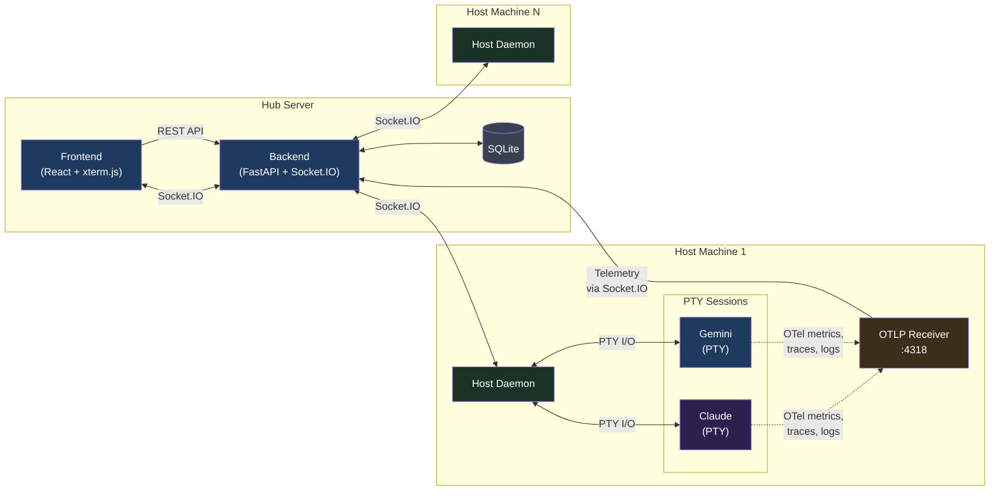
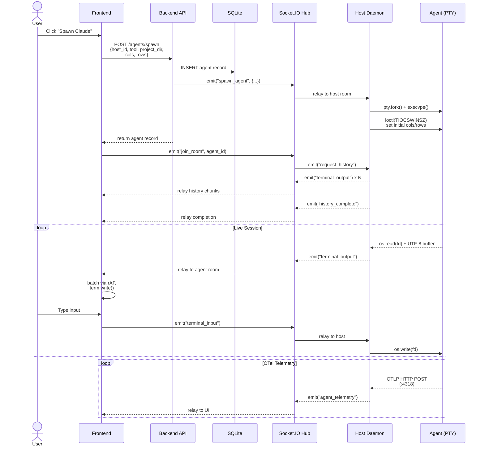

<p align="center">
  
</p>

<h1 align="center">Agent Dashboard</h1>

<p align="center">
An AI Coding Agent Dashboard designed for the Gemini CLI and Claude Code, allowing centralized orchestration and remote interaction with multiple AI agent sessions across different machines.
</p>

## Architecture

- **Frontend**: React (TypeScript) via Vite, `xterm.js`, and `socket.io-client`. Central command UI.
- **Backend (Hub)**: Python 3.9+ with FastAPI and `python-socketio`. Manages the database and relays commands.
- **Host Daemon**: Background service running on remote development machines. Listens for `spawn` commands from the hub and multiplexes Agent I/O.
- **Agent**: A specific AI CLI session (Gemini, Claude, or Bash) running inside a pseudo-terminal on a Host.



### Agent Spawn Flow

When a user clicks "Spawn" in the UI, the request passes through
three services before an agent process starts:



## Deployment on RHEL 9 with Podman (The Hub)

The Hub (Backend + Frontend) is configured to run as rootless containers using `podman-compose`.

### Prerequisites
```bash
sudo dnf install podman podman-compose
```

### Running the Hub (Local Test Configuration)
1. Build and start the containers (Always use `--no-cache` after code changes to ensure the latest version is built):
   ```bash
   podman-compose build --no-cache && podman-compose up -d
   ```
2. Hub UI: `http://localhost:8080`
3. Hub API: `http://localhost:8000`

---

## Remote Host Setup

Each machine you want to orchestrate needs to run the `Host Daemon`.

### 1. Register the Host
First, register your machine with the Hub to get a `HOST_TOKEN`:
```bash
curl -X POST http://localhost:8000/hosts \
  -H "Content-Type: application/json" \
  -d '{"name": "my-dev-workstation", "host_token": "secret-token-123"}'
```

### 2. Run the Host Daemon (Containerized)

It is recommended to mount your local development directory, AI tool configuration folders, and GCP credentials so the spawned agents can access your code and maintain persistent settings.

#### Option A: Manual Run (Testing)
```bash
cd agent/
podman build -t agent-dashboard-daemon -f Containerfile .

podman run -d --name host-daemon --network=host \
  --security-opt label=disable \
  -e DASHBOARD_URL="http://127.0.0.1:8000" \
  -e HOST_TOKEN="secret-token-123" \
  -e PROJECTS_ROOT="/git" \
  -e GEMINI_API_KEY="your-key-here" \
  -e CLAUDE_CODE_USE_VERTEX=1 \
  -e CLOUD_ML_REGION="us-east5" \
  -e ANTHROPIC_VERTEX_PROJECT_ID="your-gcp-project-id" \
  -v /path/to/your/git:/git \
  -v $HOME/.ssh:/root/.ssh:ro \
  -v $HOME/.gitconfig:/root/.gitconfig:ro \
  -v $HOME/.gemini/:/root/.gemini \
  -v $HOME/.claude/:/root/.claude \
  -v $HOME/.config/gcloud:/root/.config/gcloud:ro \
  -v $HOME/.config/gh:/root/.config/gh:ro \
  localhost/agent-dashboard-daemon:latest
```
*(Note: We use `--security-opt label=disable` instead of the `:Z` mount flag to safely grant the container access to your local files without recursively changing their SELinux labels, which can cause permission errors on large directories.)*

**Note on GitHub CLI:**
The container includes the GitHub CLI (`gh`). The `~/.config/gh` directory is mounted into the container (included in the examples above), but this alone may not be sufficient. By default, `gh auth login` stores tokens in your system keyring (GNOME Keyring, KDE Wallet, etc.), which is not accessible from inside the container. The mounted `~/.config/gh/hosts.yml` file will reference the token but won't contain it, resulting in authentication failures.

To fix this, export your token and pass it as an environment variable:
```bash
# Get your current token from the host keyring
gh auth token

# Add it to your quadlet or podman run command
Environment=GH_TOKEN=ghp_your-token-here    # quadlet
# or
-e GH_TOKEN="ghp_your-token-here"           # podman run
```

The `GH_TOKEN` environment variable is recognized by `gh` automatically and takes precedence over any stored credentials. This is the recommended approach for containerized environments.

**Note on Claude Code (Vertex AI):**
If you use Claude Code via Google Cloud Vertex AI, the daemon container includes the `gcloud` CLI and supports passing GCP credentials through. You must configure GCP authentication on the **host machine** before starting the daemon — the `~/.config/gcloud` volume mount passes your credentials into the container. Refer to your organization's GCP setup instructions for details on `gcloud init`, `gcloud auth application-default login`, and any required quota project configuration.

The following environment variables must be set on the daemon for Vertex AI:
- `CLAUDE_CODE_USE_VERTEX=1`
- `CLOUD_ML_REGION` — your GCP region (e.g., `us-east5`)
- `ANTHROPIC_VERTEX_PROJECT_ID` — your GCP project ID

#### Option B: Running on Boot (Rootless Systemd Quadlet)
For a robust setup where the daemon starts automatically on boot without relying on user login sessions, you should create a **rootless** Podman Quadlet. This ensures the daemon runs as your user account, preventing file permission issues when agents create or modify files in your repositories.

Create a new file at `~/.config/containers/systemd/agent-dashboard-daemon.container`:

```ini
[Unit]
Description=Agent Dashboard Host Daemon
After=network-online.target

[Container]
Image=localhost/agent-dashboard-daemon:latest
Network=host
SecurityLabelDisable=true

# Environment Variables
Environment=DASHBOARD_URL=http://your-server-ip:8000
Environment=HOST_TOKEN=secret-token-123
Environment=PROJECTS_ROOT=/git
Environment=GEMINI_API_KEY=your-key-here
Environment=CLAUDE_CODE_USE_VERTEX=1
Environment=CLOUD_ML_REGION=us-east5
Environment=ANTHROPIC_VERTEX_PROJECT_ID=your-gcp-project-id

# Volume Mounts (using %h for your home directory)
Volume=%h/path/to/your/git:/git
Volume=%h/.ssh:/root/.ssh:ro
Volume=%h/.gitconfig:/root/.gitconfig:ro
Volume=%h/.gemini/:/root/.gemini
Volume=%h/.claude/:/root/.claude
Volume=%h/.config/gcloud:/root/.config/gcloud:ro
Volume=%h/.config/gh:/root/.config/gh:ro

[Install]
WantedBy=default.target
```

After creating the file, reload the user systemd daemon and start the generated service:
```bash
systemctl --user daemon-reload
systemctl --user start agent-dashboard-daemon.service
```

*Note: Ensure you have enabled lingering for your user account so the service starts on boot and remains running after you log out:*
```bash
sudo loginctl enable-linger $USER
```

### 3. Spawn Agents
Go to the Web UI (`http://localhost:8080`). You will see your workstation listed. Click **"Spawn Gemini"**, **"Spawn Claude"**, or **"Spawn Bash"** to start a remote session.

**Note on Host Management:**
- **Host Deletion:** You can dynamically remove offline or retired hosts from the dashboard by clicking the "Delete" trash can icon. This will safely cascade and clean up all historical agent sessions and logs associated with that host.

**Note on Agent Spawning:**
- **Project Selection:** The daemon automatically scans the `PROJECTS_ROOT` directory in the background every 60 seconds. You can select a project directory for the agent to start in via the dropdown menu. You can also force a refresh of this list if you've recently added a new project.

**Note on Console UX:**
- **Detached Windows:** Attaching to a terminal now opens a standalone browser popup window with minimal interface, allowing for side-by-side multi-tasking across different agents.
- **Dynamic Resizing:** Terminals perfectly scale to match the window viewport size in real-time, instantly relaying geometry changes back to the underlying remote PTY.
- **Dynamic Window Title:** The browser tab title updates dynamically to show the tool type, host name, project, and git branch (e.g. "Claude · myhost · agent-dashboard · main"), making it easy to identify sessions when multiple terminal windows are open.
- **History Replay:** If you close a terminal window and re-attach later, the dashboard automatically replays the recent session history so you can pick up exactly where you left off.
- **Color Support:** Terminals are configured with `xterm-256color` support for rich CLI output.
- **Line Replacement Support:** Terminals properly handle cursor movement and line-erase escape sequences for spinner animations, progress bars, and streaming LLM output. The PTY read buffer is sized to deliver complete render frames to xterm.js in single writes, preventing visual artifacts from split escape sequences. A UTF-8 byte buffer ensures multi-byte characters (box-drawing, emoji) are never split across reads, eliminating `�` replacement artifacts.
- **Smooth Rendering:** Terminal output is batched per animation frame to prevent visible scroll jumping during rapid output. History replay writes all chunks in a single pass. The ResizeObserver is debounced to avoid intermediate PTY resize flicker during layout transitions. Initial PTY dimensions are set at spawn time to match the frontend terminal size, avoiding a brief mismatch with the default 80x24.
- **Touch Scrolling:** Terminal viewports support native vertical touch scrolling on touch-screen devices.
- **Live Telemetry (OTel):** The dashboard now uses standardized OpenTelemetry (OTLP) to capture model names and token usage. The Host Daemon runs a local OTLP receiver (port 4318) that child agents (Gemini, Claude) report to, ensuring 100% accurate stats without screen-scraping or interfering with terminal performance. Bash agents omit these stat boxes dynamically.

---

### Running in Production (Internal Lab)
If you are deploying this strictly for an internal, private lab network, you can simplify the deployment by continuing to bypass OIDC authentication and avoiding reverse proxies.

1. Ensure the `BYPASS_AUTH=true` flag remains in your `compose.yml`.
2. To allow machines on your network to access the UI and the Backend API, you must explicitly set the `VITE_API_URL` environment variable for the frontend.

Create a `.env` file in the root directory (or inject it directly into `compose.yml`):
```bash
# Replace 'your-server-ip' with the actual IP address or local DNS name of the host
VITE_API_URL=http://your-server-ip:8000
```

Then, update your `compose.yml` to pass this to the frontend build:

```yaml
  frontend:
    build:
      context: ./frontend
      dockerfile: Containerfile
      args:
        VITE_API_URL: ${VITE_API_URL}
    ports:
      - "8080:80"
```

*(Note: You will also need to update `frontend/Containerfile` to accept `ARG VITE_API_URL` and pass it during the `npm run build` step.)*

**3. Configure the Firewall (RHEL 9):**
To allow other machines on your lab network to access the dashboard and the API, run the following commands:
```bash
sudo firewall-cmd --permanent --add-port=8080/tcp
sudo firewall-cmd --permanent --add-port=8000/tcp
sudo firewall-cmd --reload
```

### Persistence & Boot Behavior
- **Data Persistence:** The SQLite database is stored in the `dashboard_data` Podman volume, which survives container updates and system reboots.
- **Service Persistence (Lingering):** By default, RHEL kills all user processes when a user logs out. For **rootless** services to start automatically at boot and remain running after logout, you **must** enable "lingering" for the service account:
  ```bash
  sudo loginctl enable-linger $USER
  ```
  This ensures the user's systemd manager is initialized at boot time and kept active indefinitely.

### Running on Boot (Systemd Quadlets for RHEL 9)
For a robust, production-grade deployment on RHEL 9/Fedora that does **not** rely on the source directory or `compose.yml` at runtime, use **Podman Quadlets**. This ensures systemd directly manages the containers using only the built images.

1. **Create the Quadlet definitions:**
   Create the following three files in the global systemd containers directory (`/etc/containers/systemd/`):

   **`/etc/containers/systemd/agent-dashboard-data.volume`**
   ```ini
   [Volume]
   VolumeName=dashboard_data
   ```

   **`/etc/containers/systemd/agent-dashboard-backend.container`**
   ```ini
   [Unit]
   Description=Agent Dashboard Backend
   After=network-online.target

   [Container]
   Image=localhost/agent-dashboard_backend:latest
   PublishPort=8000:8000
   Volume=agent-dashboard-data.volume:/app/data
   Environment=DATABASE_URL=sqlite:////app/data/agent_dashboard.db
   Environment=BYPASS_AUTH=true

   [Install]
   WantedBy=multi-user.target
   ```

   **`/etc/containers/systemd/agent-dashboard-frontend.container`**
   ```ini
   [Unit]
   Description=Agent Dashboard Frontend
   After=network-online.target agent-dashboard-backend.service

   [Container]
   Image=localhost/agent-dashboard_frontend:latest
   PublishPort=8080:80

   [Install]
   WantedBy=multi-user.target
   ```

2. **Reload systemd and start the services:**
   Systemd's Podman generator will automatically parse these Quadlets on reload and implicitly "enable" them based on the `[Install]` section. Because they are generated units, you do not use the `enable` command directly.

   ```bash
   sudo systemctl daemon-reload
   
   # Start the backend and frontend (this automatically creates the volume)
   sudo systemctl start agent-dashboard-backend.service
   sudo systemctl start agent-dashboard-frontend.service
   ```
