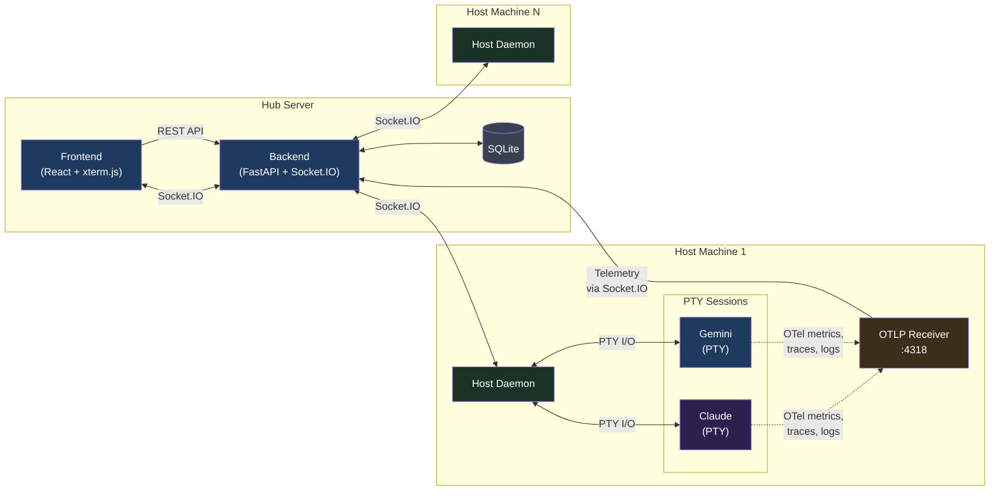
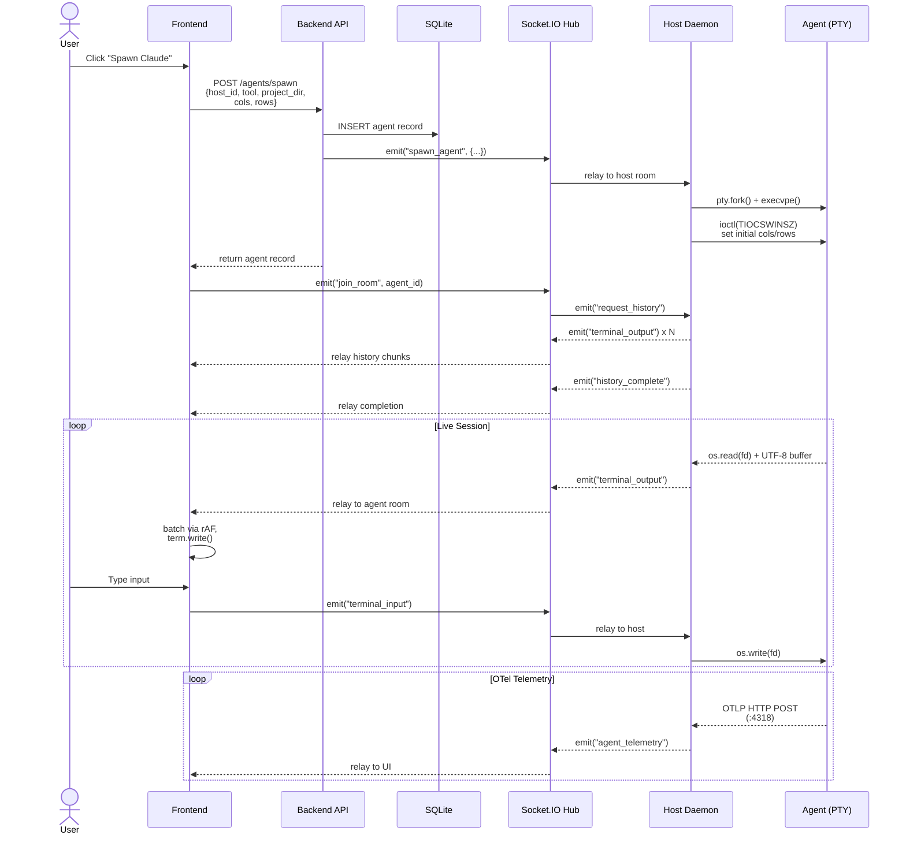

<p align="center">
  
</p>

<h1 align="center">Agent Dashboard</h1>

<p align="center">
An AI Coding Agent Dashboard designed for the Gemini CLI and Claude Code, allowing centralized orchestration and remote interaction with multiple AI agent sessions across different machines.
</p>

<p align="center">
  
</p>

## Overview

Agent Dashboard is a **multi-host orchestration platform** for
AI coding agents. It remotely spawns, monitors, and provides
interactive terminal access to Gemini CLI and Claude Code
sessions running across multiple development machines — all
from a single web interface.

The platform consists of three layers: a **React frontend**
served by Nginx, a **FastAPI + Socket.IO backend hub** that
coordinates sessions, and **containerized host daemons** deployed
on each development machine. The daemons spawn agent processes
in pseudo-terminals, relay I/O over Socket.IO, and collect
OpenTelemetry telemetry including token usage, model info, and
session cost.

## Features

### Core Architecture
- **Multi-host orchestration** — Deploy containerized daemons on
  any number of development machines. Spawn and manage Gemini,
  Claude, and Bash sessions across all hosts from a single
  dashboard.
- **Remote PTY terminals** — Full `xterm-256color` terminal
  emulation via pseudo-terminals, not a log viewer or chat
  interface. Supports cursor movement, line-erase sequences,
  spinners, progress bars, and streaming LLM output.
- **Live telemetry (OpenTelemetry)** — Each host daemon runs a
  local OTLP receiver that captures model names, token usage
  (input/output/cache breakdown), and session cost directly from
  agent CLI tools — no screen-scraping or terminal interference.
- **Cost tracking** — Real session cost from Claude Code's OTLP
  metrics; estimated cost for Gemini from built-in pricing
  tables. Displayed per-session on each agent card.

### Agent Management
- **Project selection** — Daemons scan `PROJECTS_ROOT` for git
  repositories (configurable depth); select a project directory
  from the dropdown when spawning an agent.
- **Session resume** — Agents can resume their latest session on
  spawn, preserving conversation context across daemon restarts.
- **Companion sessions** — Open a Bash shell alongside a Claude
  or Gemini session in the same project directory.
- **Host management** — Register, monitor, and delete hosts with
  cascading cleanup of associated sessions.

### Terminal UX
- **Detached terminal windows** — Attach to any session in a
  standalone browser popup for side-by-side multitasking.
- **Session history replay** — Close and re-attach to a terminal
  window; recent output is automatically replayed.
- **Dynamic resizing** — Terminals scale to match the browser
  viewport in real-time, relaying geometry changes to the
  remote PTY.
- **Smooth rendering** — Output is coalesced at the PTY level
  and batched per animation frame on the frontend. Resize events
  are debounced and deferred during active streaming.
- **UTF-8 & multi-byte safety** — A byte buffer ensures
  multi-byte characters (box-drawing, emoji) are never split
  across reads.
- **Touch scrolling** — Native vertical touch scrolling in
  terminal viewports.

### Telemetry & Monitoring
- **Token breakdown** — Per-session tracking of input, output,
  cache read, and cache creation tokens with compact display.
- **Context window bar** — Live visualization of current context
  window usage with dynamic scaling per model.
- **Bash session telemetry** — Current working directory, last
  command, and exit code displayed on bash cards via
  `PROMPT_COMMAND` sidecar injection.
- **Agent status** — Working, idle, and permission-waiting states
  derived from OTLP activity and terminal output patterns.
- **MCP server detection** — Detects configured MCP servers from
  `.mcp.json`, `~/.claude.json`, or `~/.gemini/settings.json`.

## Similar Tools

The following projects offer alternative approaches to AI agent orchestration:

- **Agent Dashboard** (This project)
  - A web-based platform that provides multi-host orchestration and remote pseudo-terminal (PTY) access to AI agent sessions with live OpenTelemetry metrics.
  - **Ideal for:** Remote, web-based interaction with isolated AI agent sessions across multiple host machines via full PTY emulation.
  - **Not ideal for:** Users who prefer to work exclusively within a local, native terminal multiplexer.
  - **Restrictions:** Designed specifically to orchestrate supported CLI agents (currently Gemini CLI, Claude Code, and Bash) rather than general-purpose GUI agents or arbitrary scripts.

- **[Agent Commander](https://github.com/cvsloane/agent-commander)**
  - A terminal-native orchestration tool built on `tmux` that manages local and remote AI agent sessions via live streaming and terminal-based approvals.
  - **Ideal for:** Terminal-native users who want to orchestrate multi-host AI agent sessions directly from the command line.
  - **Not ideal for:** Users seeking a graphical web dashboard or those unfamiliar with terminal multiplexers.
  - **Restrictions:** Heavily dependent on `tmux` and operates strictly within the constraints of terminal-based user interfaces.

- **[Agent Orchestrator](https://github.com/ComposioHQ/agent-orchestrator)**
  - An open-source orchestration layer (by Composio) for fleets of parallel AI coding agents (Claude Code, Aider, Codex). It uses a dual-layer design with a **Planner** to decompose backlog issues (GitHub/Linear/Jira) and an **Executor** to handle technical interactions in isolated **git worktrees**.
  - **Ideal for:** Automating a full "Agent Ops" lifecycle, including autonomous CI healing (detecting and fixing breaking code), review handling (routing comments back to agents), and parallel PR management.
  - **Not ideal for:** One-off interactive chat sessions or developers who prefer a strictly local, dependency-free setup.
  - **Restrictions:** Its integration layer (tools, trackers, and notifications) is powered by the **Composio API**, typically requiring an API key and tying it to the Composio ecosystem. It is heavily optimized for CI-centric workflows.

- **[Botminter](https://botminter.github.io/botminter/)**
  - A "batteries-included" CLI tool that treats an AI coding team and its processes as a version-controlled Git repository. It functions as an orchestrator (using the **Ralph orchestrator**) to provision specialized agents following specific organizational "profiles."
  - **Ideal for:** Teams wanting to standardize AI workflows across an entire organization with version-controlled coding standards, documentation rules, and architectural patterns.
  - **Not ideal for:** Simple, one-off tasks or users who prefer a graphical dashboard over a CLI-first, configuration-as-code approach.
  - **Restrictions:** Currently in **Pre-Alpha** and heavily optimized for the **Claude Code** ecosystem, with deep integrations for GitHub repos and boards. Its profiles are currently primarily designed for Claude.

- **[Claude Squad](https://github.com/smtg-ai/claude-squad)**
  - A command-line multiplexer for running multiple AI coding assistants simultaneously, utilizing `git worktree` to isolate concurrent tasks into separate branches.
  - **Ideal for:** Multiplexing multiple AI coding assistants simultaneously in isolated local environments from the command line.
  - **Not ideal for:** Managing remote agent sessions across different physical machines or needing a web-based UI.
  - **Restrictions:** Relies on local `git worktree` isolation and is primarily focused on a specific set of supported CLI assistants (Claude, Gemini, Aider) rather than arbitrary commands.

- **[Zinc](https://github.com/comebertrand/zinc)**
  - A persistent background daemon and Terminal User Interface (TUI) multiplexer designed specifically for AI coding agents.
  - **Ideal for:** Running AI coding agents as persistent background daemons and seamlessly switching between them using a TUI.
  - **Not ideal for:** Web-based multi-machine orchestration or graphical monitoring of token/cost telemetry.
  - **Restrictions:** Local-only execution with no built-in mechanism for multi-host remote orchestration or advanced visual telemetry.

## Architecture



### Agent Spawn Flow

When a user clicks "Spawn" in the UI, the request passes through
three services before an agent process starts:



## Quick Start

Get the hub running locally with a single compose command:

```bash
# Clone the repository
git clone https://github.com/dustinblack/agent-dashboard.git
cd agent-dashboard

# Build and start the hub (backend + frontend)
podman-compose build && podman-compose up -d
# or with Docker Compose:
# docker compose build && docker compose up -d
```

- **UI**: `http://localhost:8080`
- **API**: `http://localhost:8000`

> [!TIP]
> Use `--no-cache` on subsequent builds after code changes to ensure
> the latest version is built:
> ```bash
> podman-compose build --no-cache && podman-compose up -d
> ```

## Deployment

### Prerequisites

You need a container runtime and a compose tool installed on the hub
server.

> [!TIP]
> **Distro-specific install examples:**
>
> | Distro | Command |
> |--------|---------|
> | Fedora / RHEL 9+ | `sudo dnf install podman podman-compose` |
> | Debian / Ubuntu | `sudo apt install podman podman-compose` or install [Docker Engine](https://docs.docker.com/engine/install/) |
> | macOS | `brew install podman podman-compose` or install [Docker Desktop](https://www.docker.com/products/docker-desktop/) |

### 1. Build and Start the Hub

```bash
podman-compose build --no-cache && podman-compose up -d
# or with Docker Compose:
# docker compose build --no-cache && docker compose up -d
```

The compose file starts two services:
- **backend** on port `8000` (FastAPI + Socket.IO)
- **frontend** on port `8080` (React served by Nginx)

### 2. Network Configuration

By default the frontend connects to the backend on `localhost`. To
allow other machines on your network to access the dashboard, set
`VITE_API_URL` before building.

Create a `.env` file in the project root:

```bash
# Replace with the actual IP or hostname of your hub server
VITE_API_URL=http://your-server-ip:8000
```

Then rebuild the frontend:

```bash
podman-compose build --no-cache && podman-compose up -d
```

The `compose.yml` already passes `VITE_API_URL` as a build arg to the
frontend container.

> [!NOTE]
> **Firewall (firewalld-based systems):**
> ```bash
> sudo firewall-cmd --permanent --add-port=8080/tcp
> sudo firewall-cmd --permanent --add-port=8000/tcp
> sudo firewall-cmd --reload
> ```

> [!NOTE]
> If you are deploying for an internal, private lab network, you can
> simplify the deployment by keeping `BYPASS_AUTH=true` in your
> `compose.yml` to skip OIDC authentication.

### 3. Register a Host

Register each development machine with the hub to obtain a
`HOST_TOKEN`:

```bash
curl -X POST http://your-server-ip:8000/hosts \
  -H "Content-Type: application/json" \
  -d '{"name": "my-dev-workstation", "host_token": "secret-token-123"}'
```

### 4. Build and Run the Host Daemon

Build the daemon container image on each host machine:

```bash
cd agent/
podman build -t agent-dashboard-daemon -f Containerfile .
# or: docker build -t agent-dashboard-daemon -f Containerfile .
```

Run the daemon:

```bash
podman run -d --name host-daemon --network=host \
  --privileged \
  -e DASHBOARD_URL="http://your-server-ip:8000" \
  -e HOST_TOKEN="secret-token-123" \
  -e PROJECTS_ROOT="/git" \
  -e OTLP_PORT="4318" \
  -e GEMINI_API_KEY="your-key-here" \
  -e CLAUDE_CODE_USE_VERTEX=1 \
  -e CLOUD_ML_REGION="us-east5" \
  -e ANTHROPIC_VERTEX_PROJECT_ID="your-gcp-project-id" \
  -v /path/to/your/git:/git \
  -v $HOME/.ssh:/root/.ssh:ro \
  -v $HOME/.gitconfig:/root/.gitconfig:ro \
  -v $HOME/.gemini/:/root/.gemini \
  -v $HOME/.claude/:/root/.claude \
  -v $HOME/.config/gcloud:/root/.config/gcloud:ro \
  -v $HOME/.config/gh:/root/.config/gh:ro \
  -v $HOME/.config/glab-cli:/root/.config/glab-cli:ro \
  localhost/agent-dashboard-daemon:latest
```

> [!WARNING]
> `--privileged` is required for container-in-container support
> (e.g., agents building and running containers during development
> sessions). This also implicitly disables SELinux label confinement.

#### Environment Variables

| Variable | Description | Default |
|----------|-------------|---------|
| `DASHBOARD_URL` | URL of the hub backend | *(required)* |
| `HOST_TOKEN` | Token from the host registration step | *(required)* |
| `PROJECTS_ROOT` | Root directory for project scanning | *(required)* |
| `OTLP_PORT` | OTLP telemetry receiver port | `4318` |
| `PROJECTS_DEPTH` | Max scan depth below `PROJECTS_ROOT` | `6` |
| `GEMINI_API_KEY` | API key for Gemini CLI | — |
| `CLAUDE_CODE_USE_VERTEX` | Set to `1` to use Vertex AI for Claude | — |
| `CLOUD_ML_REGION` | GCP region (e.g., `us-east5`) | — |
| `ANTHROPIC_VERTEX_PROJECT_ID` | GCP project ID for Vertex AI | — |
| `GH_TOKEN` | GitHub CLI personal access token | — |
| `GITLAB_TOKEN` | GitLab CLI personal access token | — |

#### Volume Mounts

| Host Path | Container Path | Mode | Purpose |
|-----------|---------------|------|---------|
| `/path/to/your/git` | `/git` | rw | Project source code |
| `~/.ssh` | `/root/.ssh` | ro | SSH keys for git operations |
| `~/.gitconfig` | `/root/.gitconfig` | ro | Git configuration |
| `~/.gemini/` | `/root/.gemini` | rw | Gemini CLI settings |
| `~/.claude/` | `/root/.claude` | rw | Claude Code settings |
| `~/.config/gcloud` | `/root/.config/gcloud` | ro | GCP credentials |
| `~/.config/gh` | `/root/.config/gh` | ro | GitHub CLI config |
| `~/.config/glab-cli` | `/root/.config/glab-cli` | ro | GitLab CLI config |

#### GitHub CLI Authentication

> [!IMPORTANT]
> The container includes the GitHub CLI (`gh`). Mounting
> `~/.config/gh` alone is usually not sufficient because `gh auth
> login` stores tokens in your system keyring (GNOME Keyring, KDE
> Wallet, etc.), which is not accessible from inside the container.
>
> Export your token and pass it as an environment variable instead:
> ```bash
> # Get your current token from the host keyring
> gh auth token
>
> # Pass it to the container
> -e GH_TOKEN="ghp_your-token-here"           # podman/docker run
> Environment=GH_TOKEN=ghp_your-token-here    # quadlet
> ```
> The `GH_TOKEN` environment variable is recognized by `gh`
> automatically and takes precedence over stored credentials.

#### GitLab CLI Authentication

> [!IMPORTANT]
> The container includes the GitLab CLI (`glab`). Similar to `gh`,
> mounting `~/.config/glab-cli` alone may not be sufficient if your
> token is stored in the system keyring.
>
> Pass your token as an environment variable instead:
> ```bash
> # Pass it to the container
> -e GITLAB_TOKEN="glpat_your-token-here"       # podman/docker run
> Environment=GITLAB_TOKEN=glpat_your-token-here # quadlet
> ```
> The `GITLAB_TOKEN` environment variable is recognized by `glab`
> automatically and takes precedence over stored credentials.

#### Claude Code (Vertex AI)

> [!NOTE]
> If you use Claude Code via Google Cloud Vertex AI, the daemon
> container includes the `gcloud` CLI and supports passing GCP
> credentials through. Configure GCP authentication on the **host
> machine** before starting the daemon — the `~/.config/gcloud`
> volume mount passes your credentials into the container.
>
> Required environment variables for Vertex AI:
> - `CLAUDE_CODE_USE_VERTEX=1`
> - `CLOUD_ML_REGION` — your GCP region (e.g., `us-east5`)
> - `ANTHROPIC_VERTEX_PROJECT_ID` — your GCP project ID

### 5. Use the Dashboard

1. Open the UI at `http://your-server-ip:8080`.
2. Your registered hosts appear on the dashboard.
3. Click **"Spawn Gemini"**, **"Spawn Claude"**, or **"Spawn Bash"**
   to start a remote agent session.
4. Select a project directory from the dropdown — the daemon scans
   `PROJECTS_ROOT` in the background every 60 seconds (you can also
   force a refresh).
5. Click on a running session to attach in a detached terminal window.
6. Delete offline or retired hosts via the trash can icon; associated
   sessions and logs are cascaded.

## Running as a System Service

For production deployments, use systemd quadlets so that containers
start automatically on boot without relying on the source directory or
`compose.yml`.

### Hub Services (Quadlets)

Create the following files in `/etc/containers/systemd/`:

**`/etc/containers/systemd/agent-dashboard-data.volume`**
```ini
[Volume]
VolumeName=dashboard_data
```

**`/etc/containers/systemd/agent-dashboard-backend.container`**
```ini
[Unit]
Description=Agent Dashboard Backend
After=network-online.target

[Container]
Image=localhost/agent-dashboard_backend:latest
PublishPort=8000:8000
Volume=agent-dashboard-data.volume:/app/data
Environment=DATABASE_URL=sqlite:////app/data/agent_dashboard.db
Environment=BYPASS_AUTH=true

[Install]
WantedBy=multi-user.target
```

**`/etc/containers/systemd/agent-dashboard-frontend.container`**
```ini
[Unit]
Description=Agent Dashboard Frontend
After=network-online.target agent-dashboard-backend.service

[Container]
Image=localhost/agent-dashboard_frontend:latest
PublishPort=8080:80

[Install]
WantedBy=multi-user.target
```

Reload and start:
```bash
sudo systemctl daemon-reload
sudo systemctl start agent-dashboard-backend.service
sudo systemctl start agent-dashboard-frontend.service
```

### Host Daemon (Rootless Quadlet)

For the host daemon, use a **rootless** quadlet so agents run as your
user and file permissions are preserved. Create
`~/.config/containers/systemd/agent-dashboard-daemon.container`:

```ini
[Unit]
Description=Agent Dashboard Host Daemon
After=network-online.target

[Container]
Image=localhost/agent-dashboard-daemon:latest
Network=host
PodmanArgs=--privileged

# Environment Variables
Environment=DASHBOARD_URL=http://your-server-ip:8000
Environment=HOST_TOKEN=secret-token-123
Environment=PROJECTS_ROOT=/git
# OTLP telemetry receiver port (default 4318; change when
# running multiple daemons on the same host)
Environment=OTLP_PORT=4318
Environment=GEMINI_API_KEY=your-key-here
Environment=GH_TOKEN=ghp_your-token-here
Environment=GITLAB_TOKEN=glpat_your-token-here
Environment=CLAUDE_CODE_USE_VERTEX=1
Environment=CLOUD_ML_REGION=us-east5
Environment=ANTHROPIC_VERTEX_PROJECT_ID=your-gcp-project-id

# Volume Mounts (using %h for your home directory)
Volume=%h/path/to/your/git:/git
Volume=%h/.ssh:/root/.ssh:ro
Volume=%h/.gitconfig:/root/.gitconfig:ro
Volume=%h/.gemini/:/root/.gemini
Volume=%h/.claude/:/root/.claude
Volume=%h/.config/gcloud:/root/.config/gcloud:ro
Volume=%h/.config/gh:/root/.config/gh:ro
Volume=%h/.config/glab-cli:/root/.config/glab-cli:ro

[Install]
WantedBy=default.target
```

Reload and start:
```bash
systemctl --user daemon-reload
systemctl --user start agent-dashboard-daemon.service
```

> [!IMPORTANT]
> **Lingering:** By default, most Linux distributions kill user
> processes on logout. For rootless services to start at boot and
> persist after logout, enable lingering:
> ```bash
> sudo loginctl enable-linger $USER
> ```

## Persistence

- The SQLite database is stored in the `dashboard_data` named volume,
  which survives container updates and reboots.
- The database path inside the container is
  `/app/data/agent_dashboard.db`.

## Development

### Prerequisites

- Python 3.9+
- Node.js 20+
- `pip` and `npm`

### Setup

```bash
# Install Python dev dependencies
pip install -r backend/requirements.txt \
            -r agent/requirements.txt \
            -r requirements-dev.txt

# Install frontend dependencies
cd frontend && npm install && cd ..

# Install the pre-commit hook
./scripts/install-hooks.sh
```

> [!IMPORTANT]
> **AI agent development:** If you are using an AI coding agent
> (Claude Code, Gemini CLI, etc.) to develop on this project, always
> install the pre-commit hook first. AI agents can introduce
> formatting, linting, and type errors that slip past review. The
> hook runs format, lint, typecheck, and secret detection checks
> automatically on every commit, catching these issues before they
> reach the repository.

### Running Checks

Use `scripts/check.sh` to run checks by category:

```bash
./scripts/check.sh <category>
```

| Category | What it runs |
|----------|-------------|
| `format` | `black` (Python), `prettier` (frontend) |
| `lint` | `flake8` + `pylint` (Python), `eslint` (frontend) |
| `typecheck` | TypeScript type checking (`tsc`) |
| `build` | Frontend production build |
| `test` | Backend unit tests with coverage |
| `e2e` | End-to-end tests |
| `security` | `bandit` (Python), `npm audit` (frontend) |
| `secrets` | Secret detection (`gitleaks`) |
| `containers` | Build all container images |
| `precommit` | format + lint + typecheck + secrets (fast) |
| `ci` | format + lint + typecheck + build + test + security + secrets |
| `all` | ci + e2e + containers |

### Code Coverage

Backend unit test coverage reports are generated at
`coverage/backend/index.html`.

### CI Pipeline

GitHub Actions runs on all PRs and pushes to `main`. The pipeline
includes:

- **Python checks**: formatting, linting, security scan (bandit),
  unit tests with coverage
- **Frontend checks**: formatting, linting, type checking, build,
  security audit (npm audit)
- **Secret detection**: gitleaks
- **E2E tests**: end-to-end Socket.IO integration tests
- **Container builds**: verifies all three Containerfiles build
  successfully

See [`.github/workflows/ci.yml`](.github/workflows/ci.yml) for
details.
