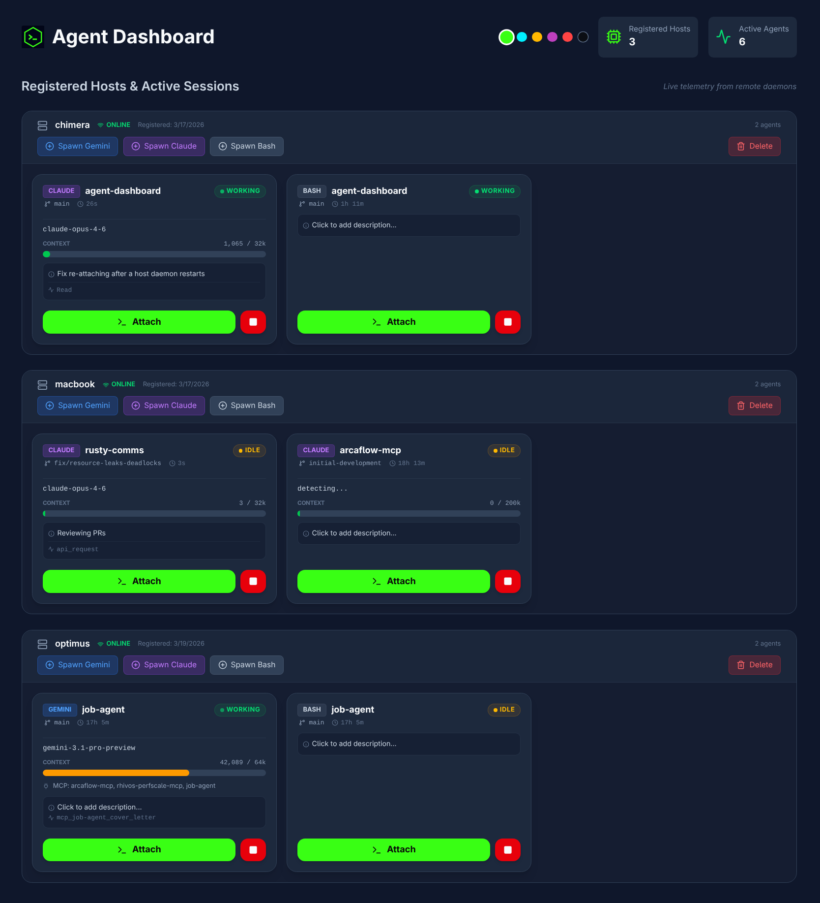
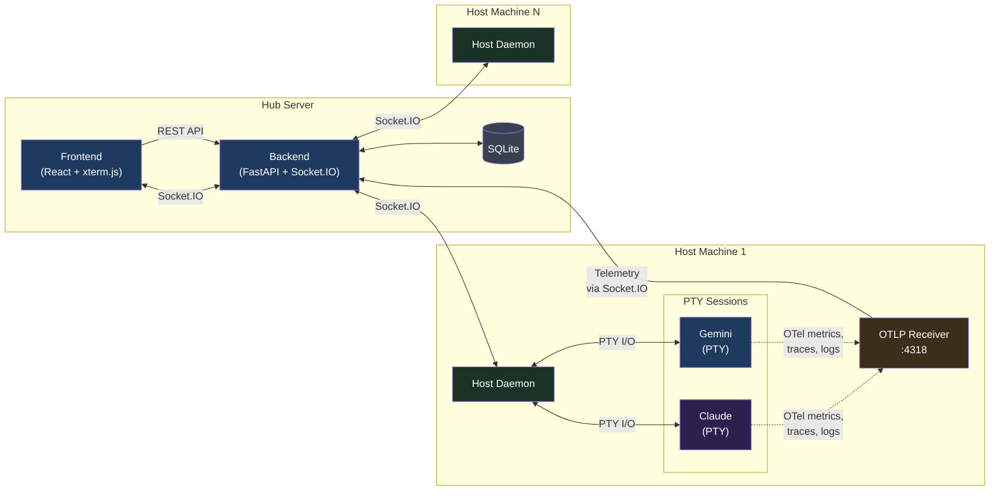
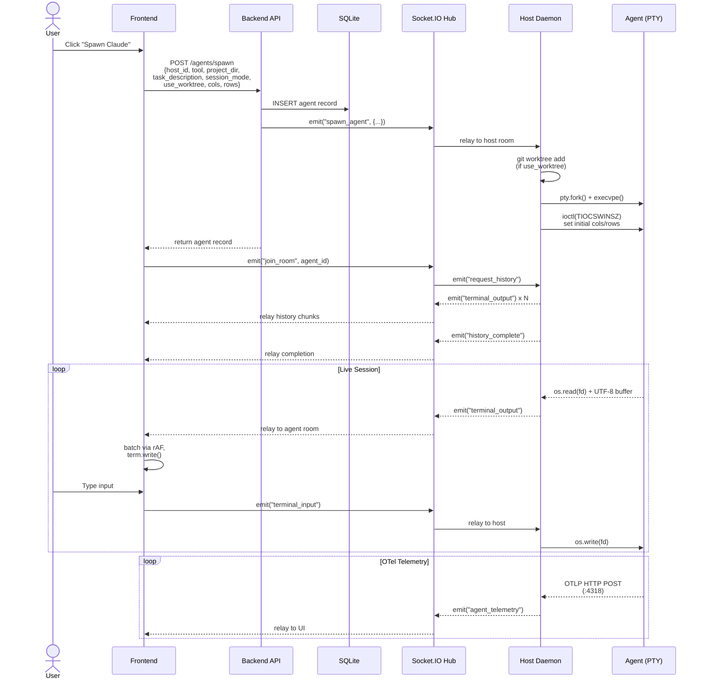
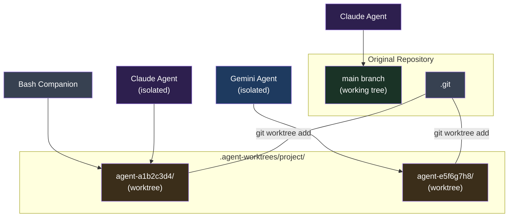

<p align="center">
  
</p>

<h1 align="center">Agent Dashboard</h1>

<p align="center">
A multi-host orchestration platform for AI coding agents — spawn, monitor, and interact with Gemini CLI and Claude Code sessions across multiple machines from a single web dashboard.
</p>

<p align="center">
  <a href="https://github.com/dustinblack/agent-dashboard/actions/workflows/ci.yml"></a>
  <a href="https://github.com/dustinblack/agent-dashboard/releases/latest"></a>
  <a href="https://github.com/dustinblack/agent-dashboard/blob/main/LICENSE"></a>
  
  
  
</p>

<p align="center">
  
</p>

## Overview

Agent Dashboard is a **multi-host orchestration platform** for
AI coding agents. It remotely spawns, monitors, and provides
interactive terminal access to Gemini CLI and Claude Code
sessions running across multiple development machines — all
from a single web interface.

> [!TIP]
> **How it works:** Install the hub (backend + frontend) on any
> server with `podman-compose up`. Deploy a daemon container on
> each development machine. Open the web dashboard to spawn,
> monitor, and interact with AI agent sessions remotely — full
> terminal access, live telemetry, and cost tracking from your
> browser.

The platform consists of three layers: a **React frontend**
served by Nginx, a **FastAPI + Socket.IO backend hub** that
coordinates sessions, and **containerized host daemons** deployed
on each development machine. The daemons spawn agent processes
in pseudo-terminals, relay I/O over Socket.IO, and collect
OpenTelemetry telemetry including token usage, model info, and
session cost.

> **Browser support:** Modern browsers (Chrome, Firefox, Edge,
> Safari 15+). Touch scrolling supported on tablets. The layout
> is responsive and renders well on mobile devices, though it is
> primarily designed for desktop use.

## Features

### Core Architecture
- **Multi-host orchestration** — Deploy containerized daemons on
  any number of development machines. Spawn and manage Gemini,
  Claude, and Bash sessions across all hosts from a single
  dashboard.
- **Remote PTY terminals** — Full `xterm-256color` terminal
  emulation via pseudo-terminals, not a log viewer or chat
  interface. Supports cursor movement, line-erase sequences,
  spinners, progress bars, and streaming LLM output.
- **Live telemetry (OpenTelemetry)** — Each host daemon runs a
  local OTLP receiver that captures model names, token usage
  (input/output/cache breakdown), and session cost directly from
  agent CLI tools — no screen-scraping or terminal interference.
- **Cost tracking** — Real session cost from Claude Code's OTLP
  metrics; estimated cost for Gemini from built-in pricing
  tables. Displayed per-session on each agent card.

### Agent Management
- **Project selection** — Daemons scan `PROJECTS_ROOT` for git
  repositories (configurable depth); select a project directory
  from the dropdown when spawning an agent.
- **Session resume** — Agents can resume their latest session on
  spawn, preserving conversation context across daemon restarts.
- **[Git worktree](https://git-scm.com/docs/git-worktree)
  isolation** — Optionally spawn agents in isolated git worktrees
  so multiple agents can work on the same repository without
  conflicts. Smart defaults enable isolation when another agent
  is already active on the project.
- **Companion sessions** — Open a Bash shell alongside a Claude
  or Gemini session in the same project directory. Companions
  inherit the parent's working context (worktree or original).
- **Host management** — Register, monitor, and delete hosts with
  cascading cleanup of associated sessions.

### Terminal UX
- **Detached terminal windows** — Attach to any session in a
  standalone browser popup for side-by-side multitasking.
- **Session history replay** — Close and re-attach to a terminal
  window; recent output is automatically replayed.
- **Dynamic resizing** — Terminals scale to match the browser
  viewport in real-time, relaying geometry changes to the
  remote PTY.
- **Smooth rendering** — Output is coalesced at the PTY level
  and batched per animation frame on the frontend. Resize events
  are debounced and deferred during active streaming.
- **UTF-8 & multi-byte safety** — A byte buffer ensures
  multi-byte characters (box-drawing, emoji) are never split
  across reads.
- **Touch scrolling** — Native vertical touch scrolling in
  terminal viewports.

### Telemetry & Monitoring
- **Token breakdown** — Per-session tracking of input, output,
  cache read, and cache creation tokens with compact display.
- **Context window bar** — Live visualization of current context
  window usage with dynamic scaling per model.
- **Bash session telemetry** — Current working directory, last
  command, and exit code displayed on bash cards via
  `PROMPT_COMMAND` sidecar injection.
- **Agent status** — Working, idle, and permission-waiting states
  derived from OTLP activity and terminal output patterns.
- **MCP server detection** — Detects configured MCP servers from
  `.mcp.json`, `~/.claude.json`, or `~/.gemini/settings.json`.

## Getting Started

### Prerequisites

A container runtime with compose support on the hub server:

| Distro | Command |
|--------|---------|
| Fedora / RHEL 9+ | `sudo dnf install podman podman-compose` |
| Debian / Ubuntu | `sudo apt install podman podman-compose` or install [Docker Engine](https://docs.docker.com/engine/install/) |
| macOS | `brew install podman podman-compose` or install [Docker Desktop](https://www.docker.com/products/docker-desktop/) |

### 1. Start the Hub

```bash
git clone https://github.com/dustinblack/agent-dashboard.git
cd agent-dashboard
podman-compose build && podman-compose up -d
```

The compose file starts two services:
- **backend** on port `8000` — FastAPI + Socket.IO hub
- **frontend** on port `8080` — React UI served by Nginx

The SQLite database is persisted in a named volume
(`dashboard_data`) that survives container restarts.

> [!TIP]
> Use `--no-cache` on subsequent builds after code changes:
> ```bash
> podman-compose build --no-cache && podman-compose up -d
> ```

> [!NOTE]
> **Docker users:** Replace `podman-compose` with
> `docker compose` in all commands.

### 2. Network Configuration

By default the frontend connects to the backend on `localhost`.
For remote access, create a `.env` file in the project root:

```bash
VITE_API_URL=http://your-server-ip:8000
```

Then rebuild: `podman-compose build --no-cache && podman-compose up -d`

> [!NOTE]
> **Firewall (firewalld):**
> ```bash
> sudo firewall-cmd --permanent --add-port={8080,8000}/tcp
> sudo firewall-cmd --reload
> ```

> [!NOTE]
> For internal or private lab networks, keep `BYPASS_AUTH=true`
> in `compose.yml` to skip OIDC authentication.

### 3. Register a Host

Register each development machine with the hub:

```bash
curl -X POST http://your-server-ip:8000/hosts \
  -H "Content-Type: application/json" \
  -d '{"name": "my-dev-workstation", "host_token": "secret-token-123"}'
```

### 4. Deploy the Host Daemon

Build the daemon container on each host machine:

```bash
cd agent/
podman build -t agent-dashboard-daemon -f Containerfile .
```

Run with minimum required configuration:

```bash
podman run -d --name host-daemon --network=host --privileged \
  -e DASHBOARD_URL="http://your-server-ip:8000" \
  -e HOST_TOKEN="secret-token-123" \
  -e PROJECTS_ROOT="/git" \
  -v /path/to/your/git:/git \
  -v $HOME/.ssh:/root/.ssh:ro \
  -v $HOME/.gitconfig:/root/.gitconfig:ro \
  -v $HOME/.claude/:/root/.claude \
  -v $HOME/.gemini/:/root/.gemini \
  localhost/agent-dashboard-daemon:latest
```

> See the [Host Daemon Reference](docs/host-daemon.md) for the
> full list of environment variables, volume mounts, and
> authentication configuration.

### 5. Use the Dashboard

1. Open `http://your-server-ip:8080`
2. Your registered hosts appear on the dashboard
3. Click **Spawn Gemini**, **Spawn Claude**, or **Spawn Bash**
4. Select a project directory from the dropdown
5. Click a running session to attach in a terminal popup
6. Delete retired hosts via the trash icon

## Architecture



### Agent Spawn Flow

When a user clicks "Spawn" in the UI, the request passes through
three services before an agent process starts:



### Git Worktree Isolation

Worktree-isolated agents get their own branch and working tree.
Companions share the parent's worktree. The original repo stays
clean. See [git worktree](https://git-scm.com/docs/git-worktree)
for background on the underlying git feature.



## Troubleshooting

| Problem | Cause | Fix |
|---------|-------|-----|
| Terminal popup shows nginx 404 | Fedora base image update added a conflicting default server block | Rebuild frontend container (fixed in v0.4.0) |
| `netavark: setns: Operation not permitted` when running podman inside daemon | Nested container networking blocked | Daemon Containerfile configures `slirp4netns` automatically |
| Agent card reappears after clicking Stop | Terminal popup auto-reconnects the session | Close the terminal window before stopping, or upgrade to v0.3.1+ |
| `1;2c` appears in Gemini input | Terminal DA response leaks into stdin | Upgrade to v0.3.1+ (filtered automatically) |
| Token counts grow unrealistically | OTLP cumulative counters were double-counted | Upgrade to v0.3.1+ |

## Similar Tools

The following projects offer alternative approaches to AI agent orchestration:

- **Agent Dashboard** (This project)
  - A web-based platform that provides multi-host orchestration and remote pseudo-terminal (PTY) access to AI agent sessions with live OpenTelemetry metrics. Supports optional git worktree isolation for running multiple agents on the same repository, real-time cost tracking, and companion session chaining.
  - **Ideal for:** Remote, web-based interaction with isolated AI agent sessions across multiple host machines via full PTY emulation.
  - **Not ideal for:** Users who prefer to work exclusively within a local, native terminal multiplexer.
  - **Restrictions:** Only supports Gemini CLI, Claude Code, and Bash sessions. Does not orchestrate GUI-based agents, arbitrary scripts, or non-interactive processes.

- **[Agent Commander](https://github.com/cvsloane/agent-commander)**
  - A mission-control dashboard and tmux-first manager for AI agent sessions across multiple hosts. Built with Next.js, Fastify, and a Go-based agent daemon. Features approval queues for agent governance, scoped memory systems, and scheduling with runtime reuse.
  - **Ideal for:** Terminal-native users who want to orchestrate multi-host AI agent sessions with built-in approval workflows and agent governance.
  - **Not ideal for:** Users seeking a lightweight setup without an approval queue or those unfamiliar with terminal multiplexers.
  - **Restrictions:** Heavily integrated with `tmux` for session management and terminal control.

- **[Agent Orchestrator](https://github.com/ComposioHQ/agent-orchestrator)**
  - An open-source orchestration layer (by Composio) for fleets of parallel AI coding agents (Claude Code, Aider, Codex). It uses a dual-layer design with a **Planner** to decompose backlog issues (GitHub/Linear/Jira) and an **Executor** to handle technical interactions in isolated **git worktrees**.
  - **Ideal for:** Automating a full "Agent Ops" lifecycle, including autonomous CI healing (detecting and fixing breaking code), review handling (routing comments back to agents), and parallel PR management.
  - **Not ideal for:** One-off interactive chat sessions or developers who prefer a strictly local, dependency-free setup.
  - **Restrictions:** Its integration layer (tools, trackers, and notifications) is powered by the **Composio API**, typically requiring an API key and tying it to the Composio ecosystem. It is heavily optimized for CI-centric workflows.

- **[Botminter](https://botminter.github.io/botminter/)**
  - A "batteries-included" CLI tool that treats an AI coding team and its processes as a version-controlled Git repository. It functions as an orchestrator (using the **Ralph orchestrator**) to provision specialized agents following specific organizational "profiles."
  - **Ideal for:** Teams wanting to standardize AI workflows across an entire organization with version-controlled coding standards, documentation rules, and architectural patterns.
  - **Not ideal for:** Simple, one-off tasks or users who prefer a graphical dashboard over a CLI-first, configuration-as-code approach.
  - **Restrictions:** Currently in **Pre-Alpha** and heavily optimized for the **Claude Code** ecosystem, with deep integrations for GitHub repos and boards. Its profiles are currently primarily designed for Claude.

- **[Claude Squad](https://github.com/smtg-ai/claude-squad)**
  - A command-line multiplexer for running multiple AI coding assistants simultaneously, utilizing `git worktree` to isolate concurrent tasks into separate branches.
  - **Ideal for:** Multiplexing multiple AI coding assistants simultaneously in isolated local environments from the command line.
  - **Not ideal for:** Managing remote agent sessions across different physical machines or needing a web-based UI.
  - **Restrictions:** Relies on local `git worktree` isolation and is primarily focused on a specific set of supported CLI assistants (Claude, Gemini, Aider) rather than arbitrary commands.

- **[Zinc](https://github.com/ComeBertrand/zinc)**
  - A Rust-based agent management daemon that runs AI coding agents as persistent background processes. Zinc manages agents, not terminal panes — it works inside tmux, zellij, or a bare terminal, providing an interactive supervisor dashboard for switching between agents.
  - **Ideal for:** Running AI coding agents as persistent background daemons and seamlessly switching between them from the terminal.
  - **Not ideal for:** Web-based multi-machine orchestration or graphical monitoring of token/cost telemetry.
  - **Restrictions:** Local-only execution with no built-in mechanism for multi-host remote orchestration or visual telemetry dashboards.

## Development

### Prerequisites

- Python 3.9+
- Node.js 22+
- `pip` and `npm`

### Setup

```bash
# Install Python dev dependencies
pip install -r backend/requirements.txt \
            -r agent/requirements.txt \
            -r requirements-dev.txt

# Install frontend dependencies
cd frontend && npm install && cd ..

# Install the pre-commit hook
./scripts/install-hooks.sh
```

> [!IMPORTANT]
> **AI agent development:** If you are using an AI coding agent
> (Claude Code, Gemini CLI, etc.) to develop on this project,
> always install the pre-commit hook first. AI agents can
> introduce formatting, linting, and type errors that slip past
> review. The hook catches these automatically on every commit.

### Running Checks

```bash
./scripts/check.sh <category>
```

| Category | What it runs |
|----------|-------------|
| `format` | `black` (Python), `prettier` (frontend) |
| `lint` | `flake8` + `pylint` (Python), `eslint` (frontend) |
| `typecheck` | TypeScript type checking (`tsc`) |
| `build` | Frontend production build |
| `test` | Backend unit tests with coverage |
| `e2e` | End-to-end tests |
| `security` | `bandit` (Python), `npm audit` (frontend) |
| `secrets` | Secret detection (`gitleaks`) |
| `containers` | Build all container images |
| `precommit` | format + lint + typecheck + secrets (fast) |
| `ci` | format + lint + typecheck + build + test + security + secrets |
| `all` | ci + e2e + containers |

### CI Pipeline

GitHub Actions runs on all PRs and pushes to `main`. The
pipeline includes Python checks (formatting, linting, security,
tests), frontend checks (formatting, linting, typecheck, build),
secret detection (gitleaks), E2E tests, and container builds.
See [`.github/workflows/ci.yml`](.github/workflows/ci.yml).

Coverage reports are generated at `coverage/backend/index.html`.
